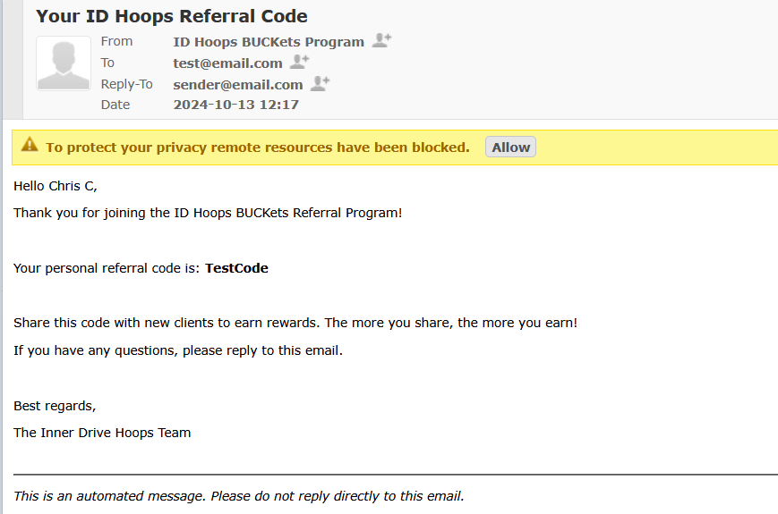
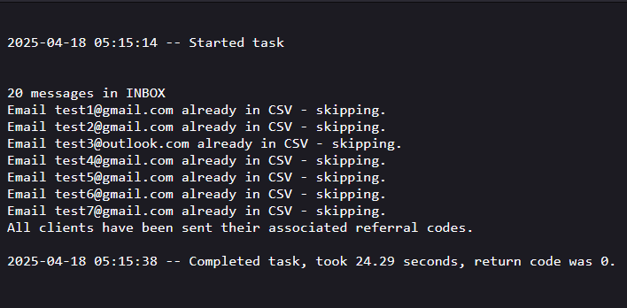

# Fully Automated Referral Code Mailbot 📬

A Python automation script used in production to:
- Parse new referral requests from an email inbox (via IMAP)
- Store new entries in a CSV (deduplicated)
- Send personalized, unique referral codes via SendGrid (HTML email)
- Log and track code delivery status

## Tech Stack

- Python
- IMAPClient
- pandas
- SendGrid API
- xlsx / CSV for lightweight persistence
- Run every 5 minutes autonomously on pythonanywhere.com

## Why I Built It

Built to streamline the referral onboarding process at my company, completely replacing a multi-step manual workflow with an instantaneous, fully automated script.

## How to Use

- Fill in your credentials
- Configure IMAPClient to scrape emails based on your specifics
- Set up a CSV file with the correct headers (`Client Emails`, `Code Sent`, `Codes`), or modify the script to work with your specific headers
- Ensure the 'Codes' column is populated with your specific codes
- Run the script to automatically send referral codes to new clients

## Sample Photos

- Example email clients receive

- Pythonanywhere terminal showing all clients have been sent their codes
  

## 🙋‍♂️ About the Author

Built and maintained by **Christopher Cottone**.  
Used in production at **Inner Drive Hoops** as the primary digital infrastructure of our fully automated referral system.

📫 [Email Me](mailto:chriscottone1@gmail.com.com)  
💼 [LinkedIn](https://www.linkedin.com/in/christopher-cottone-b9820928a/?trk=opento_sprofile_topcard)  

Currently seeking **junior/entry-level roles** in software development, automation, or technical support. Looking to build and learn as much as I can!
